# ZCU106 21項目：ソフトウェア動作シーケンス案

対象：元の21親項目 T-01〜T-21。版：レビュー案（2026-10-30）。

前の21項目レビュー版では図を外していたため、本書で各親項目に対応付ける。図は検証の意図を表す概念案で、すべてが実装済み・実機実行済みという意味ではない。B2を中心に描き、A/Cは実装や呼出し経路が異なる。Secure処理をNormalから利用する矢印は、個別図で省略したTF-A/OP-TEE経由を含む。各図の参加者は処理上の役割であり、別CPUを意味しない。

状態は会話で報告された実機観測、または設計上の区分。PASS報告は試験入口での判定確認であり、全生ログ・例外証跡を取得済みではない。細分観点の必須／補足、値、起動条件、計測閾値は親仕様レビュー後に確定する。

## 共通構成

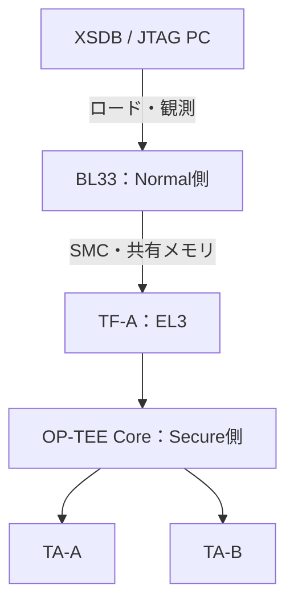
```mermaid
flowchart TD
 J["XSDB / JTAG PC"] -->|"ロード・観測"| N["BL33：Normal側"]
 N -->|"SMC・共有メモリ"| M["TF-A：EL3"]
 M --> C["OP-TEE Core：Secure側"]
 C --> A["TA-A"]
 C --> B["TA-B"]
```

## 各試験のシーケンス

### T-01：Secure／Normalの別々の実行

**目的・条件**：Normal側でELを記録し、Secureサービスを呼んでSecure側のEL・状態を記録する。Security Stateは各状態の信頼できる観測点を別途確定。  
**実装・実測の区分**：部分観測。

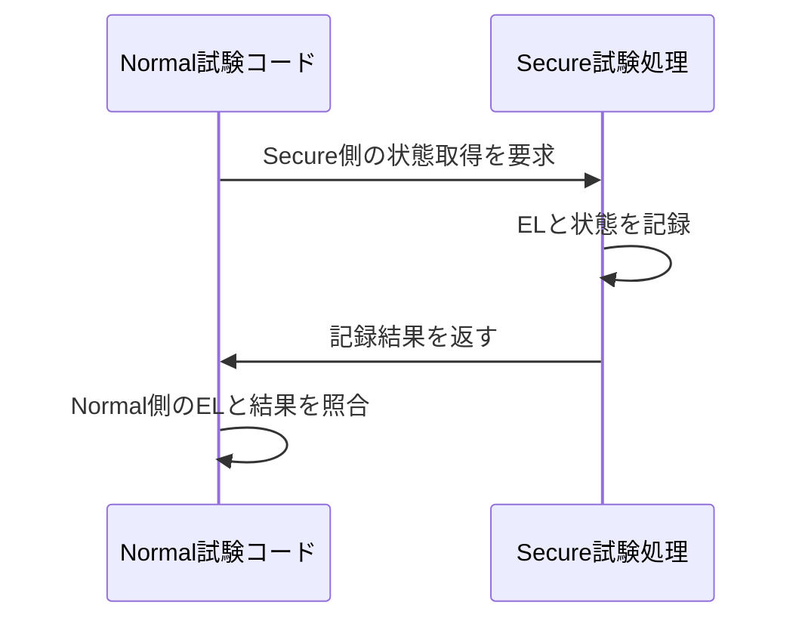
```mermaid
sequenceDiagram
 participant N as Normal試験コード
 participant S as Secure試験処理
 N->>S: Secure側の状態取得を要求
 S->>S: ELと状態を記録
 S->>N: 記録結果を返す
 N->>N: Normal側のELと結果を照合
```

### T-02：Secure呼出し・復帰

**目的・条件**：既知の入力と出力、正常復帰地点を確認する。  
**実装・実測の区分**：実機で基本往復を観測。

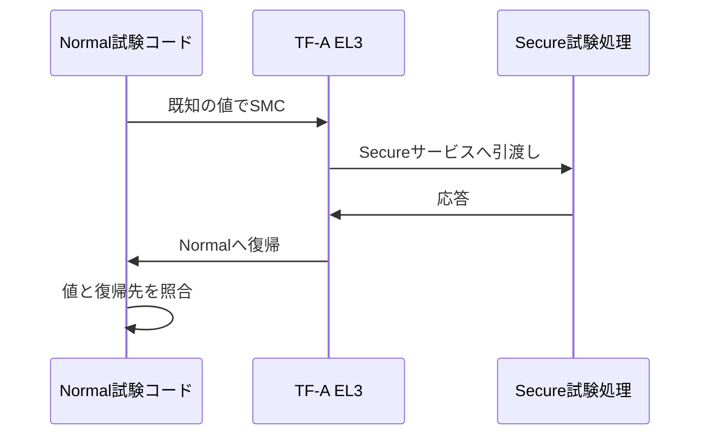
```mermaid
sequenceDiagram
 participant N as Normal試験コード
 participant M as TF-A EL3
 participant S as Secure試験処理
 N->>M: 既知の値でSMC
 M->>S: Secureサービスへ引渡し
 S->>M: 応答
 M->>N: Normalへ復帰
 N->>N: 値と復帰先を照合
```

### T-03：繰返し切替と状態保持

**目的・条件**：回数・対象register・各Worldの状態値はレビューで決める。  
**実装・実測の区分**：設計案。

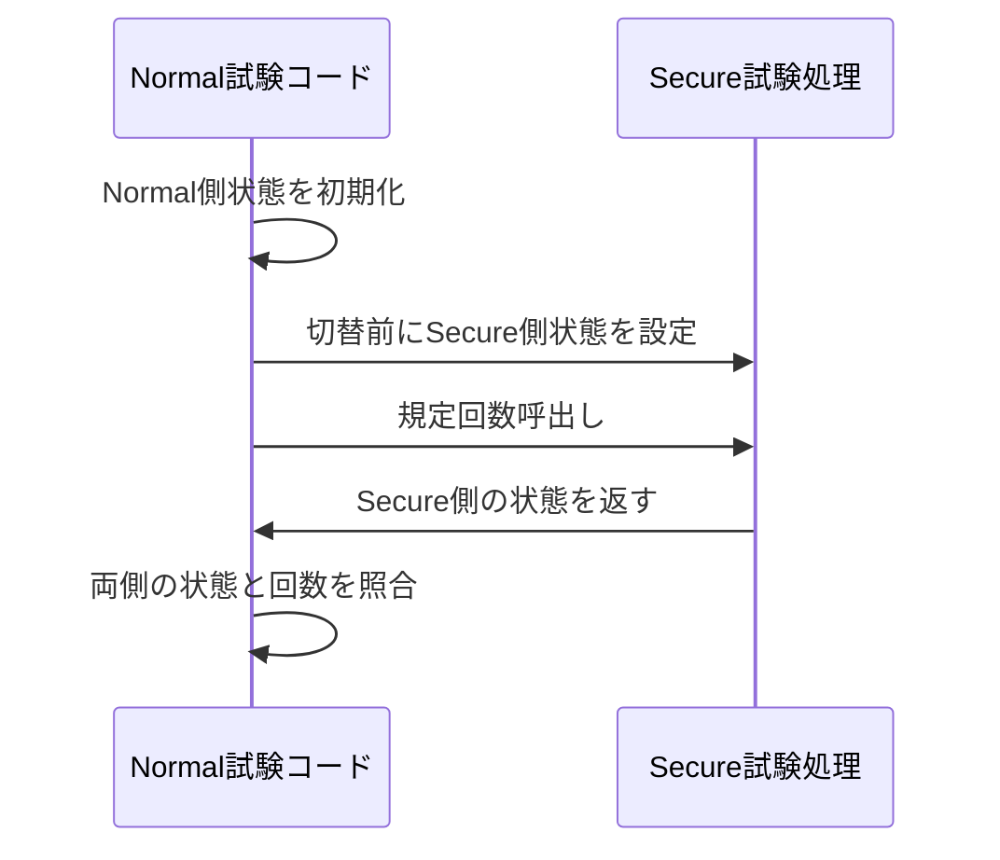
```mermaid
sequenceDiagram
 participant N as Normal試験コード
 participant S as Secure試験処理
 N->>N: Normal側状態を初期化
 N->>S: 切替前にSecure側状態を設定
 N->>S: 規定回数呼出し
 S->>N: Secure側の状態を返す
 N->>N: 両側の状態と回数を照合
```

### T-04：Secureメモリの読書き禁止

**目的・条件**：同じ物理領域でSecure正常対照・NS拒否・非改変を照合。NSの未写像だけで合格にしない。  
**実装・実測の区分**：未実装・設計案。

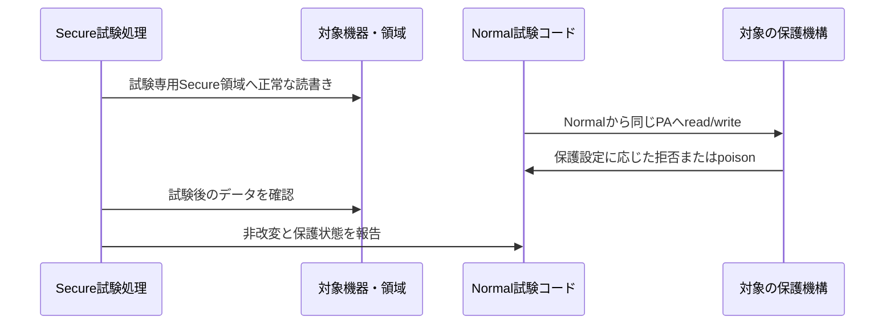
```mermaid
sequenceDiagram
 participant S as Secure試験処理
 participant D as 対象機器・領域
 participant N as Normal試験コード
 participant H as 対象の保護機構
 S->>D: 試験専用Secure領域へ正常な読書き
 N->>H: Normalから同じPAへread/write
 H->>N: 保護設定に応じた拒否またはpoison
 S->>D: 試験後のデータを確認
 S->>N: 非改変と保護状態を報告
```

### T-05：秘密領域と共有領域の使い分け

**目的・条件**：正常共有メモリとSecure領域を引数に指定した場合を比較する。Coreの引数拒否と物理保護を区別。  
**実装・実測の区分**：共有入力検査は実機PASS報告。

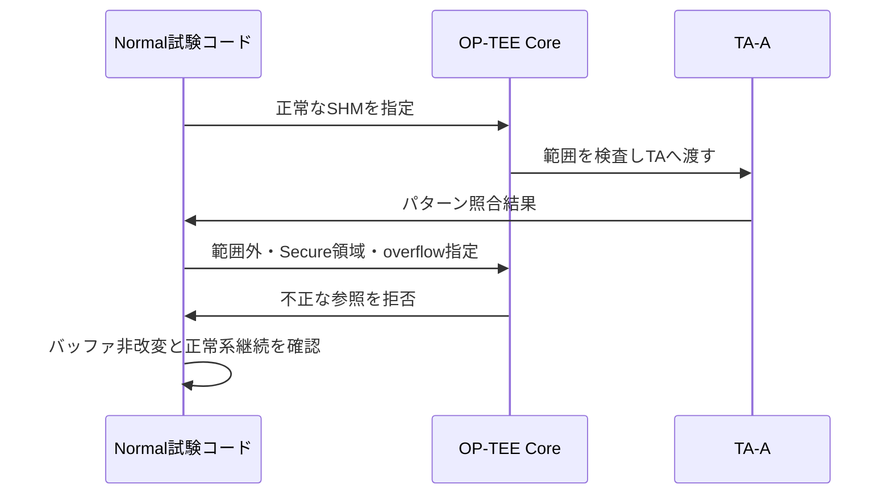
```mermaid
sequenceDiagram
 participant N as Normal試験コード
 participant C as OP-TEE Core
 participant A as TA-A
 N->>C: 正常なSHMを指定
 C->>A: 範囲を検査しTAへ渡す
 A->>N: パターン照合結果
 N->>C: 範囲外・Secure領域・overflow指定
 C->>N: 不正な参照を拒否
 N->>N: バッファ非改変と正常系継続を確認
```

### T-06：Secure周辺機器の保護

**目的・条件**：周辺機器・XPPU経路・安全な操作は未確定。  
**実装・実測の区分**：未実装・設計案。

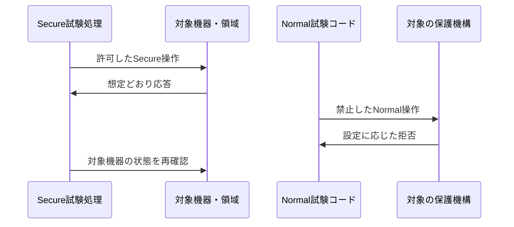
```mermaid
sequenceDiagram
 participant S as Secure試験処理
 participant D as 対象機器・領域
 participant N as Normal試験コード
 participant H as 対象の保護機構
 S->>D: 許可したSecure操作
 D->>S: 想定どおり応答
 N->>H: 禁止したNormal操作
 H->>N: 設定に応じた拒否
 S->>D: 対象機器の状態を再確認
```

### T-07：DMAからのSecureメモリ保護

**目的・条件**：master ID・属性・バッファ・保護経路が必要。  
**実装・実測の区分**：保留・設計案。

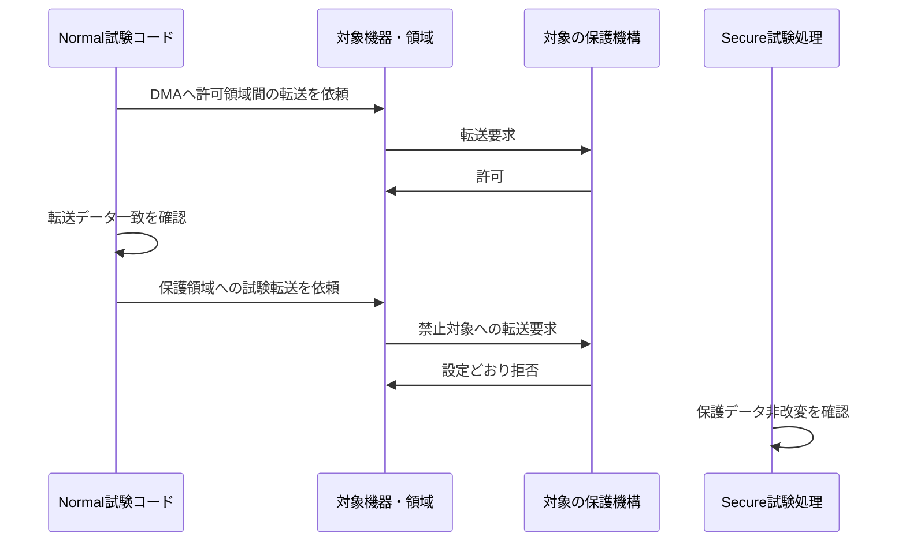
```mermaid
sequenceDiagram
 participant N as Normal試験コード
 participant D as 対象機器・領域
 participant H as 対象の保護機構
 participant S as Secure試験処理
 N->>D: DMAへ許可領域間の転送を依頼
 D->>H: 転送要求
 H->>D: 許可
 N->>N: 転送データ一致を確認
 N->>D: 保護領域への試験転送を依頼
 D->>H: 禁止対象への転送要求
 H->>D: 設定どおり拒否
 S->>S: 保護データ非改変を確認
```

### T-08：Secure割込みの配送

**目的・条件**：発生源・GIC設定・handler・状態の取得方法を決める。  
**実装・実測の区分**：未接続・設計案。

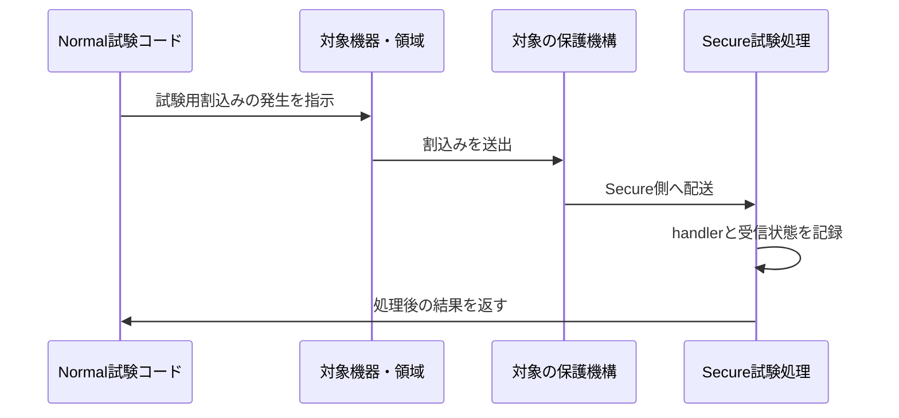
```mermaid
sequenceDiagram
 participant N as Normal試験コード
 participant D as 対象機器・領域
 participant H as 対象の保護機構
 participant S as Secure試験処理
 N->>D: 試験用割込みの発生を指示
 D->>H: 割込みを送出
 H->>S: Secure側へ配送
 S->>S: handlerと受信状態を記録
 S->>N: 処理後の結果を返す
```

### T-09：JTAGデバッグ制限

**目的・条件**：承認済みの試験設定、可逆性と対象範囲を前提にする。  
**実装・実測の区分**：未確認・設計案。

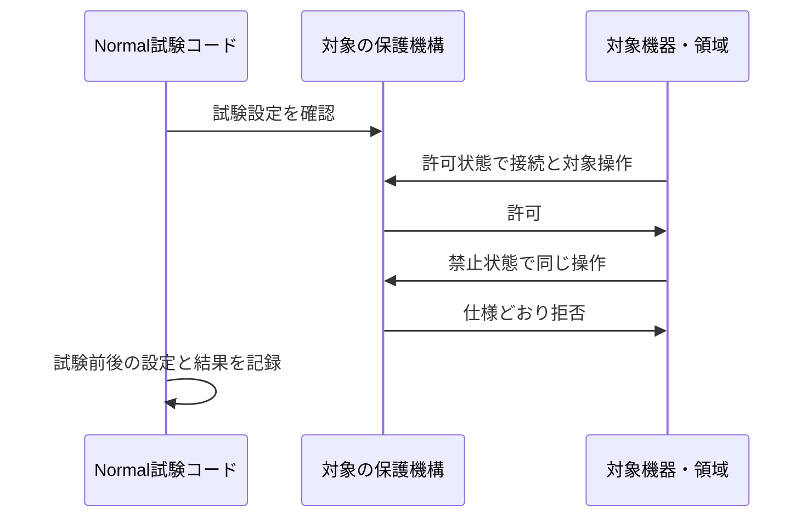
```mermaid
sequenceDiagram
 participant N as Normal試験コード
 participant H as 対象の保護機構
 participant D as 対象機器・領域
 N->>H: 試験設定を確認
 D->>H: 許可状態で接続と対象操作
 H->>D: 許可
 D->>H: 禁止状態で同じ操作
 H->>D: 仕様どおり拒否
 N->>N: 試験前後の設定と結果を記録
```

### T-10：サービスの認証・認可

**目的・条件**：TA identity認可とNormal要求者認証を分ける。後者は未実装。  
**実装・実測の区分**：部分実機PASS・親BLOCKED。

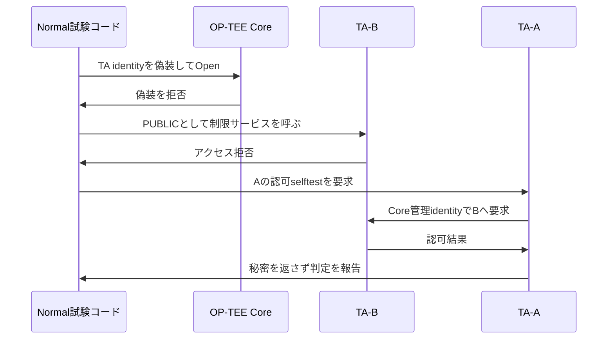
```mermaid
sequenceDiagram
 participant N as Normal試験コード
 participant C as OP-TEE Core
 participant B as TA-B
 participant A as TA-A
 N->>C: TA identityを偽装してOpen
 C->>N: 偽装を拒否
 N->>B: PUBLICとして制限サービスを呼ぶ
 B->>N: アクセス拒否
 N->>A: Aの認可selftestを要求
 A->>B: Core管理identityでBへ要求
 B->>A: 認可結果
 A->>N: 秘密を返さず判定を報告
```

### T-11：起動イメージ署名検証

**目的・条件**：SoC認証bootを対象とする。JTAG直接ロードでは代替しない。  
**実装・実測の区分**：未構成・設計案。

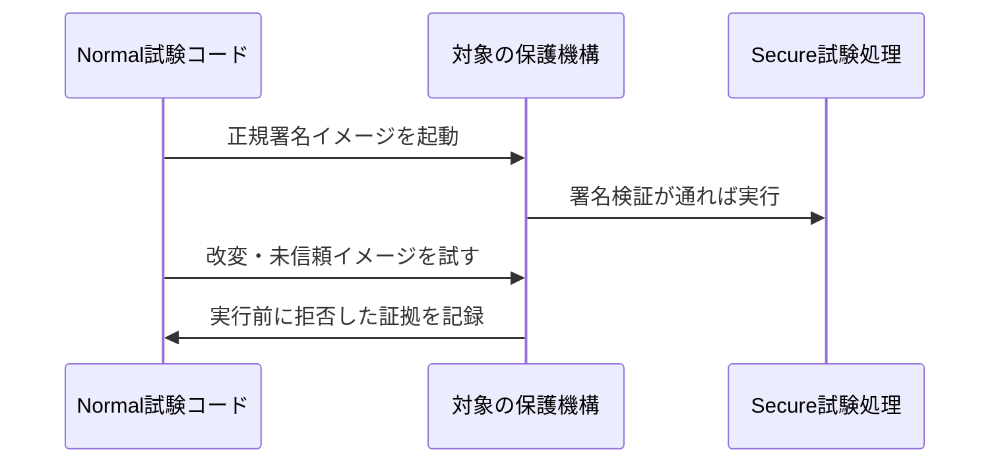
```mermaid
sequenceDiagram
 participant N as Normal試験コード
 participant H as 対象の保護機構
 participant S as Secure試験処理
 N->>H: 正規署名イメージを起動
 H->>S: 署名検証が通れば実行
 N->>H: 改変・未信頼イメージを試す
 H->>N: 実行前に拒否した証拠を記録
```

### T-12：鍵を外に出さない暗号サービス

**目的・条件**：独自export拒否・Core属性取得拒否・生メモリ抽出は別の観点。  
**実装・実測の区分**：API部分は実機PASS報告・抽出耐性未確認。

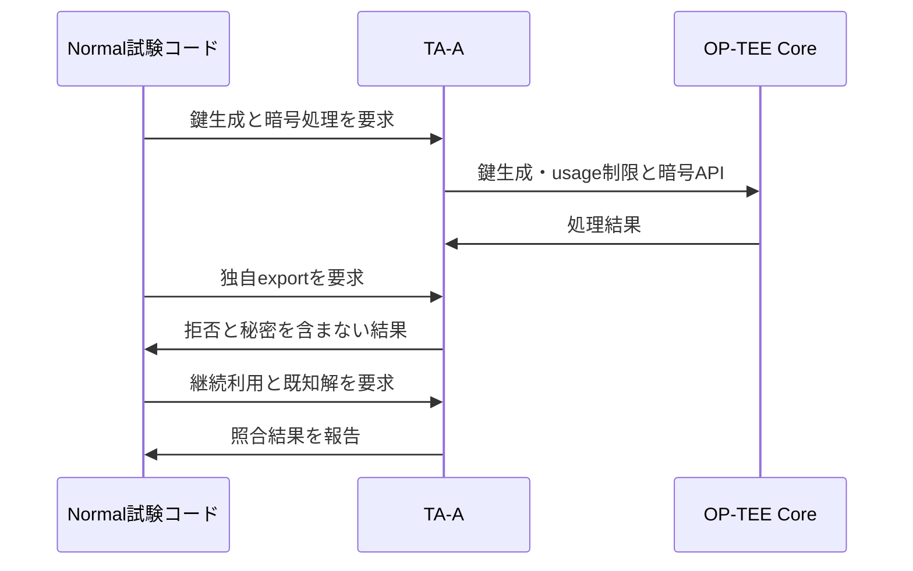
```mermaid
sequenceDiagram
 participant N as Normal試験コード
 participant A as TA-A
 participant C as OP-TEE Core
 N->>A: 鍵生成と暗号処理を要求
 A->>C: 鍵生成・usage制限と暗号API
 C->>A: 処理結果
 N->>A: 独自exportを要求
 A->>N: 拒否と秘密を含まない結果
 N->>A: 継続利用と既知解を要求
 A->>N: 照合結果を報告
```

### T-13：Secureデータ永続保存

**目的・条件**：storage backend・媒体・再起動後の観測点が必要。  
**実装・実測の区分**：未実装・設計案。

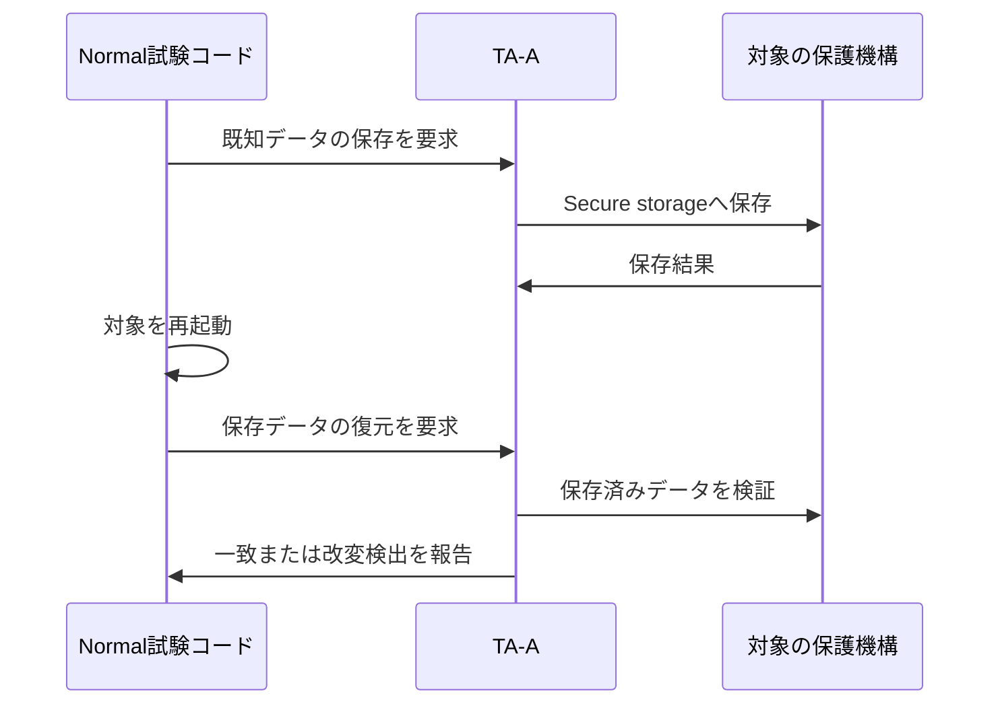
```mermaid
sequenceDiagram
 participant N as Normal試験コード
 participant A as TA-A
 participant H as 対象の保護機構
 N->>A: 既知データの保存を要求
 A->>H: Secure storageへ保存
 H->>A: 保存結果
 N->>N: 対象を再起動
 N->>A: 保存データの復元を要求
 A->>H: 保存済みデータを検証
 A->>N: 一致または改変検出を報告
```

### T-14：User TAの呼出し

**目的・条件**：Open/Invoke/Closeと、不正形式・引数・セッションの小試験を分ける。  
**実装・実測の区分**：基本呼出しは実機PASS報告。

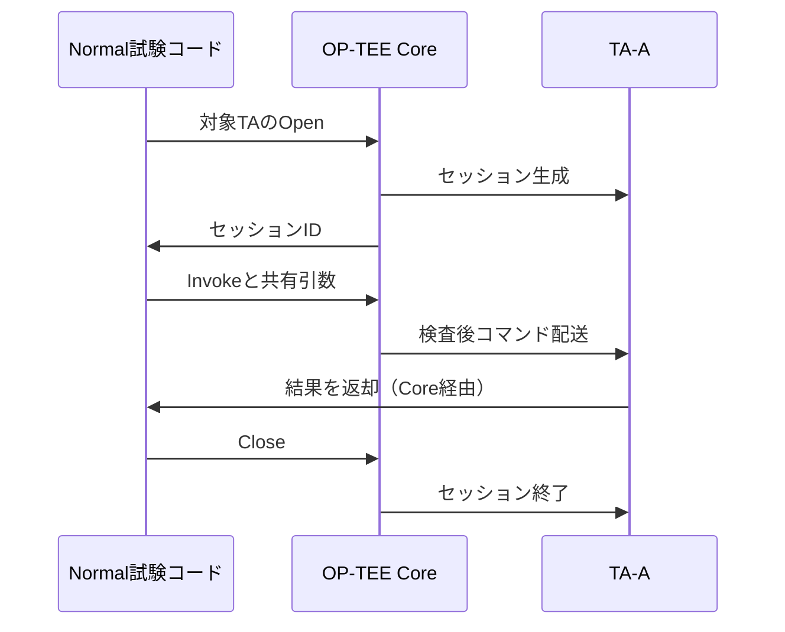
```mermaid
sequenceDiagram
 participant N as Normal試験コード
 participant C as OP-TEE Core
 participant A as TA-A
 N->>C: 対象TAのOpen
 C->>A: セッション生成
 C->>N: セッションID
 N->>C: Invokeと共有引数
 C->>A: 検査後コマンド配送
 A->>N: 結果を返却（Core経由）
 N->>C: Close
 C->>A: セッション終了
```

### T-15：2つのUser TAの分離

**目的・条件**：Bの仮想アドレスと同じ値をAで試す。Bの物理ページへ直接到達した証明ではない。ESR/FARは未採取。  
**実装・実測の区分**：TA間試験は実機PASS報告。

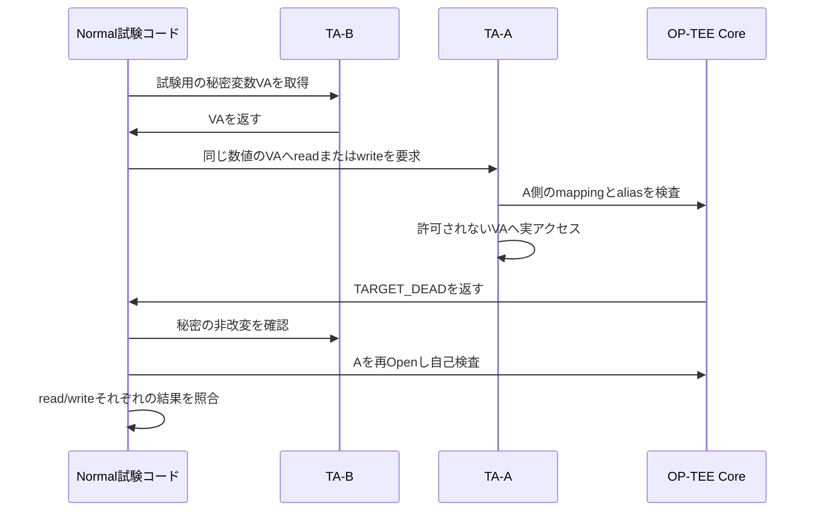
```mermaid
sequenceDiagram
 participant N as Normal試験コード
 participant B as TA-B
 participant A as TA-A
 participant C as OP-TEE Core
 N->>B: 試験用の秘密変数VAを取得
 B->>N: VAを返す
 N->>A: 同じ数値のVAへreadまたはwriteを要求
 A->>C: A側のmappingとaliasを検査
 A->>A: 許可されないVAへ実アクセス
 C->>N: TARGET_DEADを返す
 N->>B: 秘密の非改変を確認
 N->>C: Aを再Openし自己検査
 N->>N: read/writeそれぞれの結果を照合
```

### T-16：署名TAのロード・改ざん拒否

**目的・条件**：Early TAではなく外部ファイルの実runtime loaderが必要。  
**実装・実測の区分**：未実装・設計案。

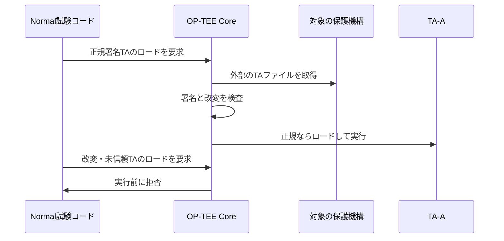
```mermaid
sequenceDiagram
 participant N as Normal試験コード
 participant C as OP-TEE Core
 participant H as 対象の保護機構
 participant A as TA-A
 N->>C: 正規署名TAのロードを要求
 C->>H: 外部のTAファイルを取得
 C->>C: 署名と改変を検査
 C->>A: 正規ならロードして実行
 N->>C: 改変・未信頼TAのロードを要求
 C->>N: 実行前に拒否
```

### T-17：Secure呼出しの往復時間

**目的・条件**：測定区間・周波数・cache/割込みを保存。ブレークポイントなしで測る。  
**実装・実測の区分**：測定機能あり・実機値未回収。

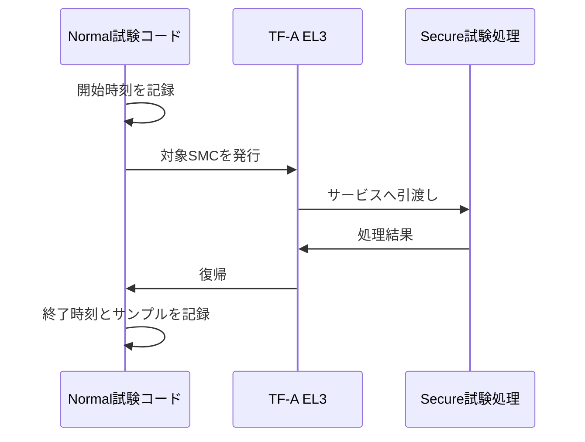
```mermaid
sequenceDiagram
 participant N as Normal試験コード
 participant M as TF-A EL3
 participant S as Secure試験処理
 N->>N: 開始時刻を記録
 N->>M: 対象SMCを発行
 M->>S: サービスへ引渡し
 S->>M: 処理結果
 M->>N: 復帰
 N->>N: 終了時刻とサンプルを記録
```

### T-18：メモリアクセス性能

**目的・条件**：Normal SHM・Secure DDR等は別系列。  
**実装・実測の区分**：一部測定機能あり・実機値未回収。

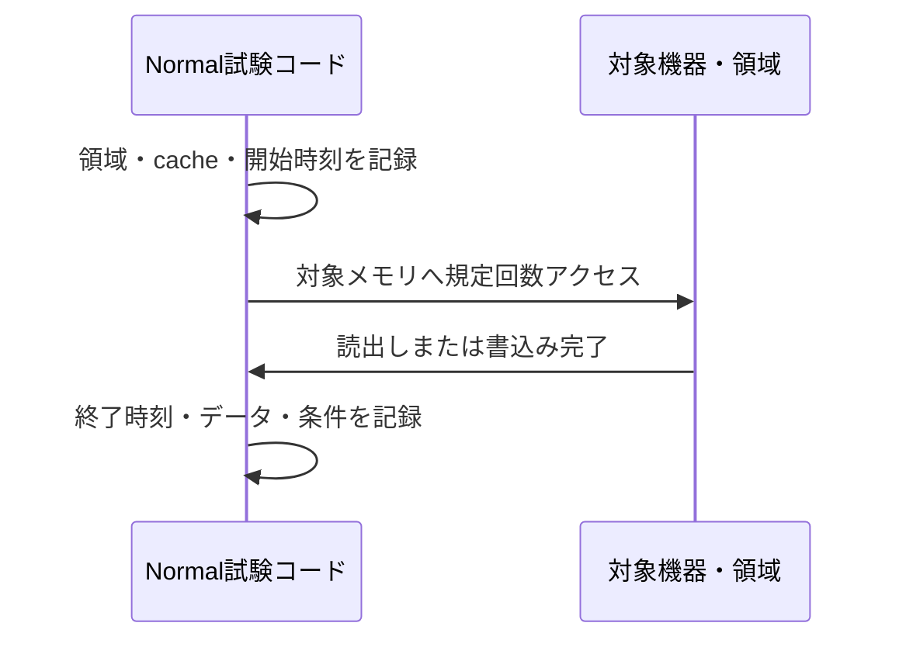
```mermaid
sequenceDiagram
 participant N as Normal試験コード
 participant D as 対象機器・領域
 N->>N: 領域・cache・開始時刻を記録
 N->>D: 対象メモリへ規定回数アクセス
 D->>N: 読出しまたは書込み完了
 N->>N: 終了時刻・データ・条件を記録
```

### T-19：Secure割込み応答時間

**目的・条件**：発生点と受信点の時計・計測位置は未確定。  
**実装・実測の区分**：未実装・設計案。

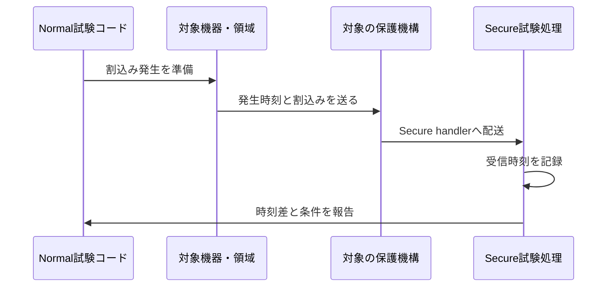
```mermaid
sequenceDiagram
 participant N as Normal試験コード
 participant D as 対象機器・領域
 participant H as 対象の保護機構
 participant S as Secure試験処理
 N->>D: 割込み発生を準備
 D->>H: 発生時刻と割込みを送る
 H->>S: Secure handlerへ配送
 S->>S: 受信時刻を記録
 S->>N: 時刻差と条件を報告
```

### T-20：許可領域のDMA転送性能

**目的・条件**：転送サイズ・cache・測定区間・完了条件を定義する。  
**実装・実測の区分**：保留・設計案。

```mermaid
sequenceDiagram
 participant N as Normal試験コード
 participant D as 対象機器・領域
 N->>N: 開始時刻を記録
 N->>D: 許可領域でDMA転送開始
 D->>D: 規定サイズを転送
 D->>N: 転送完了
 N->>N: 終了時刻と転送結果を照合
```

### T-21：TA呼出し・暗号処理時間

**目的・条件**：TA Invoke、暗号、Open/Close、復旧を区間別に測定。Storageは補足候補。  
**実装・実測の区分**：一部測定機能あり・実機値未回収。

```mermaid
sequenceDiagram
 participant N as Normal試験コード
 participant C as OP-TEE Core
 participant A as TA-A
 N->>N: 測定項目の開始時刻を記録
 N->>C: 対象操作を要求
 C->>A: 該当するTA操作
 A->>C: 実行結果
 C->>N: Normalへ復帰
 N->>N: 終了時刻・成功状態・サンプルを記録
```

## 読むときの注意

- T-04とT-15は別。TA内の仮想アドレス隔離成功は、NormalからSecure物理メモリへのXMPU等の保護を証明しない。
- T-05の不正SHM引数拒否は、Normal CPUの直接load/store拒否を意味しない。
- T-10のTA認可成功は、Normal側の本物の要求者認証を意味しない。
- T-12の独自export拒否・AES成功は、あらゆる経路からの鍵抽出耐性を意味しない。
- 未実装図の拒否や結果は期待する挙動を示しており、実機で起きたことではない。
- T-17〜T-21は性能値の回収前。性能閾値が未確定なら測定値をPASS/FAILの速度判定に変えない。
- 最新ローカル版で追加された試験本体はGitHub上から取得できなかったため、対応する関数・命令の正確な呼出し順は現物照合待ち。

参照：21項目レビュー版（T-01〜T-21）、公開offline-transferのmain.c・security_tests.c・client.c・TA実装、および実機についてのユーザー報告。

